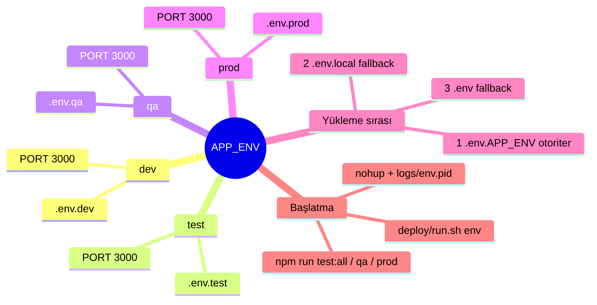
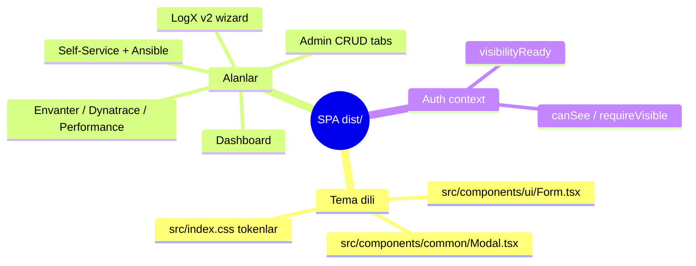

# BMW Portal — Mimari Mindmap & Hata Analizi Rehberi

> Amaç: sonraki hata analizi / geliştirme işini hızlandırmak. "Nerede ne var, sorun olunca
> nereye bakılır" tek sayfada. Kurulum: [SETUP-SIMPLE.md](SETUP-SIMPLE.md).

## 1. İstek yolu (request flow)

```mermaid
flowchart LR
  U[Kullanıcı<br/>tarayıcı] -->|HTTPS 443| N[nginx<br/>bmw.fe.garanti.com.tr]
  U -.->|HTTP 80| N
  N -->|80 → 301| N
  N -->|/ statik| D[dist/ SPA<br/>React+Vite]
  N -->|/api/* proxy<br/>X-Forwarded-Proto https| A[Node/Express<br/>server/index.cjs<br/>:3000 (tum ortamlar)]
  N -->|/api/ai-analyst/chat<br/>proxy_buffering off| A
  A --> DB[(MSSQL<br/>Envanter + Portal DB)]
  A --> LDAP[(LDAP/LDAPS)]
  A --> AWX[AWX 1..9<br/>Ansible job/template]
  A --> MCP[Dynatrace / Instana<br/>MCP route]
  A --> AI[Anthropic / OpenAI]
```

## 2. Ortam katmanları (env layers)



## 3. Port haritası

| Katman | Port | Not |
|--------|------|-----|
| nginx front (HTTPS) | **443** | TLS terminate (bmw.fe.garanti.com.tr) |
| nginx front (HTTP) | **80** | → 301 https |
| Backend (tum ortamlar) | **3000** | paylasimli, ayni anda tek aktif ortam |

| MSSQL | 1433 (veya özel) | Envanter + Portal DB |
| LDAPS | 636 | kimlik doğrulama |
| AWX / MCP / AI | 443 | dış/kurumsal |

## 4. Alt-sistem → kaynak → "hata olursa nereye bak"

| Alt-sistem | Init / Kaynak | Env anahtarları | Hata olursa nereye bak |
|---|---|---|---|
| **Boot / ortam** | `server/index.cjs` | `APP_ENV`, `PORT`, `NODE_ENV` | Boot log: `listening on :PORT · ortam=…`. Yanlış env → `.env.<env>` yüklendi mi? |
| **Auth / Session** | `server/auth/index.cjs` | `SESSION_STORE`, `SESSION_SECRET`, `LDAP_*`, `PORTAL_TRUSTED_HEADER_SECRET` | 401 döngüsü → `SESSION_STORE=mssql` + nginx `X-Forwarded-Proto https`. `GET /api/auth/session-debug`. |
| **Görünürlük (yetki)** | `server/auth/visibility.cjs` | — | 403 → `portal_element_visibility` tablosu; `resolveVisibility`/`requireVisible`. Frontend `visibilityReady`. |
| **LogX v2 (log indirme)** | `server/logx/v2/*` (`legacy.cjs`, `ocp.cjs`, `jobs.cjs`, `downloads.cjs`, `ingest.cjs`) | `AWX_LOGX_*`, `LOGX_V2_STAGING_*`, `LOGX_STAGING_FALLBACK_DIR`, `LOGX_INGEST_*` | Sonuç `artifacts.logx_result` (ham stdout parse EDİLMEZ). Çoklu-host: playbook `set_stats` aggregation. İndirme: `resolveStagedFile`. |
| **Ansible / AWX** | `server/ansible/runner.cjs`, `index.cjs` | `AWX_1..9_*`, `AWX_URL/TOKEN`, `AWX_*_TEMPLATE_ID`, `AWX_LOGX_SERVER_ID` | `AWX HTTP 404` → template yanlış sunucuda. Self-service canlı log: `ss/job-status` polling (`SelfServicePage.tsx`). |
| **DB** | `server/db/index.cjs`, `mssql-setup.cjs` | `MSSQL_*`, `PORTAL_DB_*`, `PORTAL_DB_POOL_*` | Postgres `$1`→MSSQL `@p1` adaptör. Tablolar boot'ta kurulur (non-blocking). |
| **MCP (Dynatrace/Instana)** | `server/mcp/*`, `dynatrace/`, `instana/` | `DT_MANAGED_MCP_URL`, `INSTANA_*`, `MCP_TLS_INSECURE`, `MCP_CONNECT_TIMEOUT_MS`, `CORP_CA_CERT_PATH` | TLS → `docs/TLS-SETUP.md`, `scripts/test-*-mcp.cjs`. Kurum içi route `NO_PROXY`'de olmalı. |
| **AI Analist** | `server/ai-analyst/*` | `AI_PROVIDER`, `ANTHROPIC_*`, `OPENAI_*` | SSE akışı → nginx `/api/ai-analyst/chat` `proxy_buffering off`. |
| **Nöbet** | `server/*` (nobet) | `NOBETCI_TEAM_*`, `NOBETCI_API_URL/HOST` | DNS bypass `NOBETCI_API_HOST`. |
| **Rate limit / CORS** | `server/service.cjs` | `API_RATE_LIMIT_PER_MIN`, `CORS_ORIGIN` | 429 → limit; nginx arkasında CORS genelde gerekmez. |
| **TLS / Proxy** | `server/certs/`, `scripts/build-ca-bundle.cjs` | `CORP_CA_CERT_PATH`, `HTTP_PROXY`, `HTTPS_PROXY`, `NO_PROXY` | Boot'ta `CORP_CA_CERT_PATH bulunamadı` → yol yanlış/boş bırak. |

## 5. Frontend (React/Vite)



## 6. Sorun çözerken ilk 3 komut

```bash
./deploy/run.sh <env> status          # çalışıyor mu + PORT + son loglar
./deploy/run.sh <env> logs            # canlı log akışı
curl -s localhost:<PORT>/api/auth/session-debug   # oturum/proxy teşhisi
```

> Her çözülen problem → [QUICK-SOLVER.md](QUICK-SOLVER.md)'ye kaydedilir.
