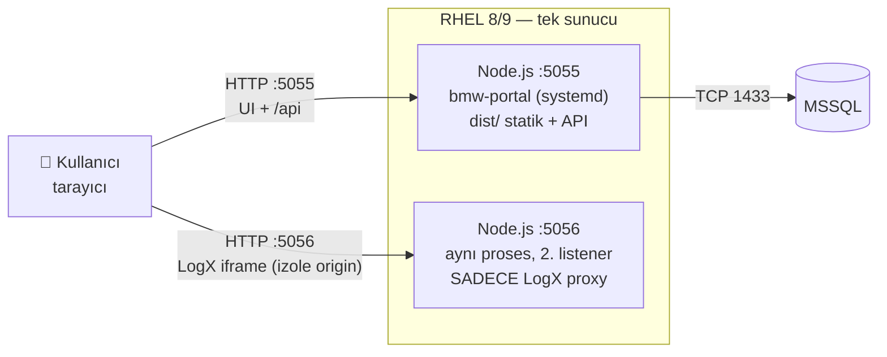
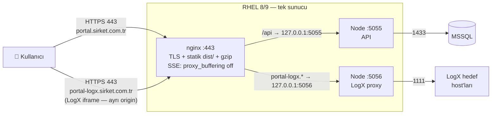
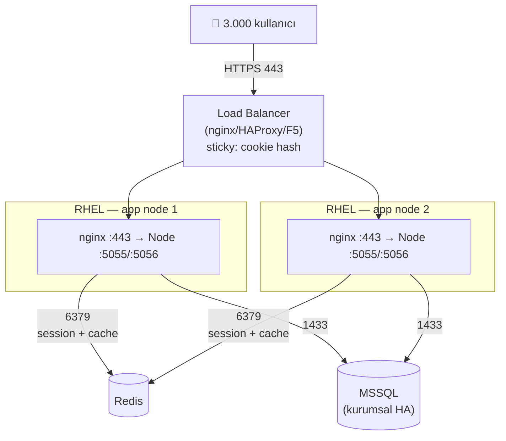
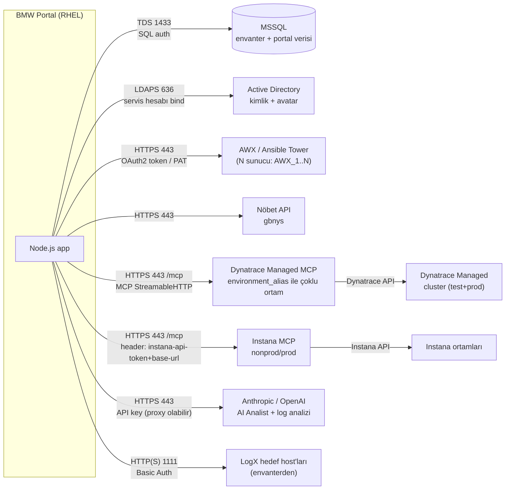
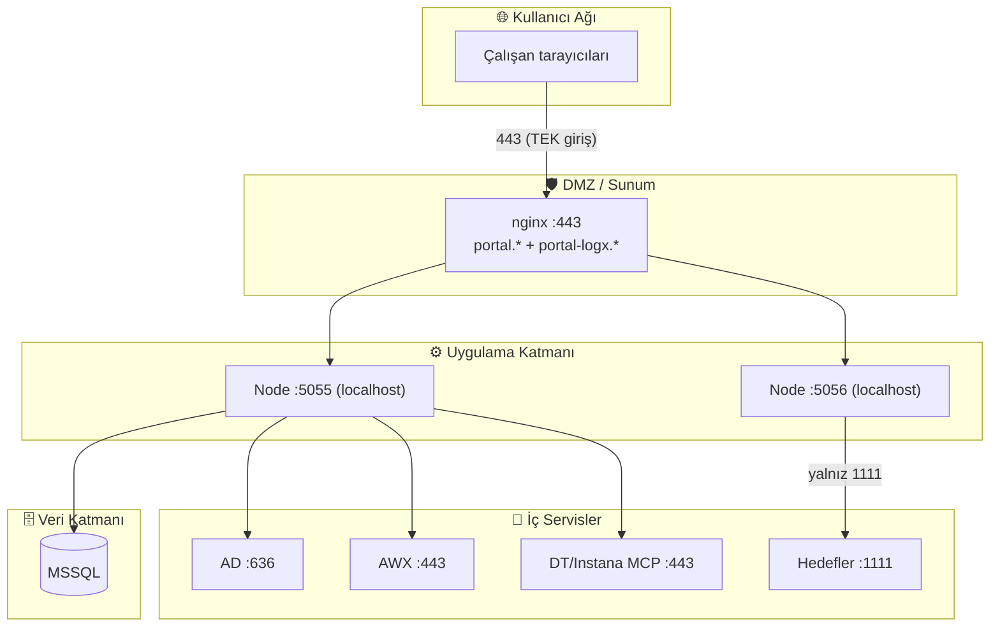

> **ARSIV** — Bu dokuman eski cok-topoloji analizini anlatir. Guncel model tek :3000 semasidir; bkz. [../DEPLOYMENT.md](../DEPLOYMENT.md).

# BMW Portal — Deployment Topolojileri

> 6 topoloji, basitten kurumsala. Diyagramlar **Mermaid** ile çizilmiştir — GitHub/GitLab
> otomatik render eder; SVG üretmek için: `npx -y @mermaid-js/mermaid-cli -i docs/TOPOLOGY.md -o docs/diagrams/`
> Kurulum adımları: [DEPLOYMENT.md](DEPLOYMENT.md) · Ölçekleme analizi: [SCALABILITY.md](SCALABILITY.md)

## Hızlı seçim

| Topoloji | Ne zaman | Kullanıcı kapasitesi |
|---|---|---|
| T1 Minimal | Dev / pilot / demo | ~25 |
| T2 Nginx + TLS | **Önerilen başlangıç prod'u** | ~250 |
| T3 HA + Redis | Kritik kullanım, kesintisizlik | ~3.000 (bkz. SCALABILITY P0'lar) |
| T4/T5/T6 | Görünümler: entegrasyon / güvenlik / CI-CD | — |

---

## T1 — Minimal Tek Sunucu (dev/pilot)

Nginx yok; Node uygulaması statiği kendisi servis eder (`NODE_ENV=production` static+SPA
fallback koddadır). TLS yok — yalnızca kapalı ağ/pilot için.



**Akış:** Tarayıcı doğrudan 5055'e gelir; uygulama hem UI'ı hem API'yi servis eder.
LogX iframe'i 5056'ya gider — aynı proses, farklı port = farklı origin (sandbox izolasyonu).

| Port | Yön | Amaç |
|---|---|---|
| 5055 | içeri | UI + API |
| 5056 | içeri | LogX proxy (izole origin) |
| 1433 | dışarı | MSSQL |

---

## T2 — Tek Sunucu + Nginx TLS (önerilen başlangıç prod'u)

Nginx TLS'i sonlandırır, statiği servis eder, API'yi proxy'ler. 5055/5056 **dışarı kapalı**.
LogX izolasyonu artık **ayrı hostname** ile sağlanır (`LOGX_PROXY_PUBLIC_URL`).



**Akış:** (1) Kullanıcı `portal.` hostuna gelir → nginx statik `dist/`'i döner.
(2) `/api/*` istekleri 5055'e proxy'lenir (`X-Forwarded-Proto https` ile — secure cookie).
(3) LogX oturumu açılınca iframe `portal-logx.` hostuna yüklenir → nginx 5056'ya proxy'ler →
uygulama hedef host :1111'e gider. (4) AI Analist SSE'si buffer'sız lokasyondan akar.

| Bileşen | Port | Not |
|---|---|---|
| nginx | 443 (80→301) | tek dışa açık kapı |
| app | 127.0.0.1:5055 | localhost-only |
| logx listener | 127.0.0.1:5056 | localhost-only |

---

## T3 — Yüksek Erişilebilirlik: LB + 2 App Node + Redis

SCALABILITY.md'deki P0'lar (session → Redis, JSON store'lar → MSSQL) çözüldükten sonra
geçilir. LogX şifre deposu (`_credStore`) bellekte kaldığı sürece LB'de **sticky session** şart.



**Akış:** LB cookie-hash sticky ile kullanıcıyı hep aynı node'a gönderir (LogX oturum
şifreleri node belleğinde). Session Redis'te olduğu için node düşerse kullanıcı diğer
node'da **oturumunu kaybetmeden** devam eder (sadece açık LogX oturumu yeniden bağlanır).
Deploy sırayla node-by-node yapılır → kesintisiz güncelleme.

---

## T4 — Tam Kurumsal Entegrasyon Haritası

Portalın konuştuğu her dış sistem, protokol ve kimlik yöntemiyle:



**Akış notları:** MCP bağlantıları tek ortak factory'den yönetilir (bağlan/yeniden bağlan/
hata takibi — `server/mcp/client.cjs`); kurumsal CA için `CORP_CA_CERT_PATH`. AI Analist,
DT+Instana MCP tool'larını tek sohbette orkestre eder. AWX çoklu sunucu desteklidir.

---

## T5 — Ağ / Güvenlik Segmentasyon Görünümü



**Neden iki hostname?** LogX, hedef sunuculardaki 3. parti log arayüzünü iframe'de
`allow-scripts` ile çalıştırır. İçerik portalla aynı origin'de olsaydı, ele geçirilmiş bir
hedef host portal oturumuna erişebilirdi. `portal-logx.*` ayrı origin'dir → tarayıcı
sandbox'ı portal DOM/cookie'sini izole eder. **Bu yüzden ikinci hostname + DNS kaydı +
nginx server bloğu güvenlik gereksinimidir, opsiyonel değildir.**

**Firewall kural özeti:**

| Kaynak | Hedef | Port | Kural |
|---|---|---|---|
| Kullanıcı ağı | Portal sunucu | 443 | İZİN |
| Kullanıcı ağı | Portal sunucu | 5055/5056 | **RED** (localhost-only) |
| Portal | MSSQL | 1433 | İZİN |
| Portal | AD | 636 | İZİN |
| Portal | AWX/MCP/Nöbet | 443 | İZİN |
| Portal | Hedef host'lar | 1111 | İZİN |
| Portal | api.anthropic.com | 443 | İZİN (veya kurumsal proxy) |

---

## T6 — CI/CD Akışı (Jenkins)

```mermaid
flowchart LR
    DEV["👨‍💻 git push"] --> J["Jenkins"]

    subgraph PIPE["Pipeline (Jenkinsfile)"]
        C["Checkout"] --> I["npm ci"] --> Q["Kalite Kapısı<br/>tsc + server syntax"] --> B["npm run build"] --> P["Paket<br/>tar.gz + arşiv"]
    end
    J --> C

    P --> G{"DEPLOY_ENV?"}
    G -- "test" --> D1["SSH → test sunucusu"]
    G -- "prod" --> OK["🧑‍⚖️ İnsan onayı<br/>(input step)"] --> D2["SSH → prod sunucusu"]

    D1 & D2 --> DS["scripts/deploy.sh<br/>releases/&lt;tarih&gt; + npm ci --omit=dev<br/>current symlink + systemctl restart"]
    DS --> H{"health check<br/>15×2s"}
    H -- "✓" --> DONE["✅ canlı + eski sürüm temizliği"]
    H -- "✗" --> RB["↩️ OTOMATİK ROLLBACK<br/>önceki release'e symlink"] --> DONE2["⚠️ pipeline FAIL + bildirim"]
```



**Akış:** Her build kalite kapısından geçer (tsc + tüm `.cjs` sözdizimi). Paket sürümlenir
ve arşivlenir (istenildiğinde elle de deploy edilebilir). Prod'a **insan onayı** olmadan
çıkılmaz. Hedefte health check geçmezse deploy scripti kendisi önceki sürüme döner —
Jenkins başarısız işaretler ama sistem ayakta kalır. Elle rollback: `bash scripts/deploy.sh --rollback`.

---

## SVG üretimi (opsiyonel)

Mermaid blokları GitHub/GitLab'da otomatik render olur. Bağımsız SVG istenirse:
```bash
npx -y @mermaid-js/mermaid-cli -i docs/TOPOLOGY.md -o docs/diagrams/topology.svg
```
(İnternet erişimli bir makinede; çıktılar `docs/diagrams/` altına düşer.)
